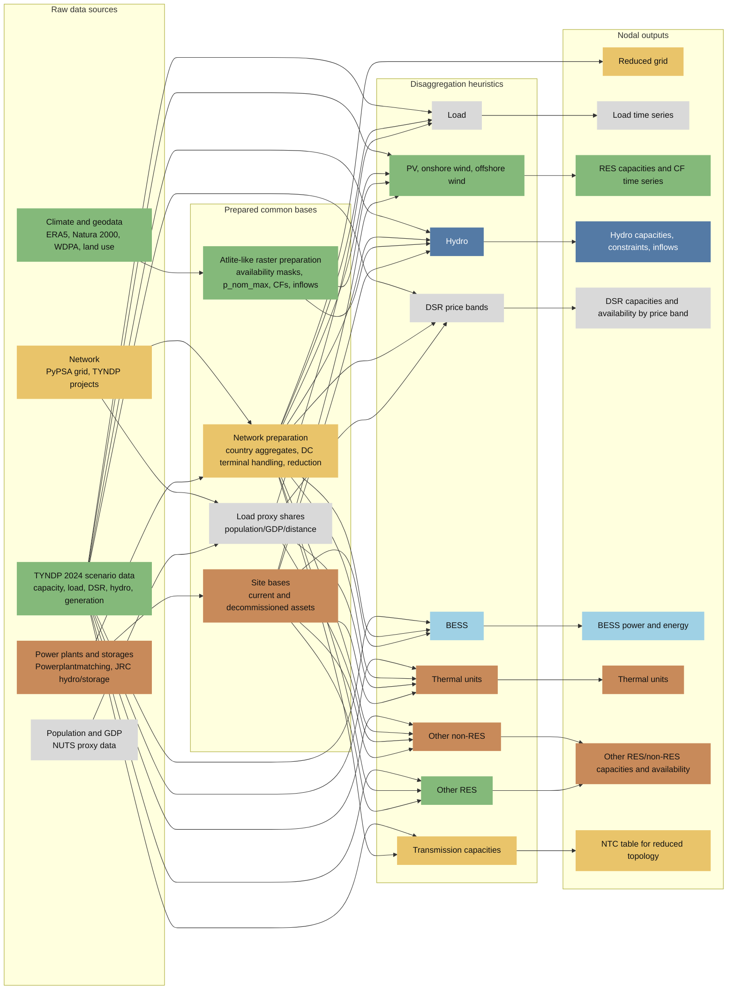

# Scenario Regionalisation Pipeline

This directory contains the preprocessing workflow used to derive nodal input
data for European unit commitment and optimal power flow studies. The pipeline
combines national TYNDP 2024 scenario data, a PyPSA-based 2025 network model,
selected TYNDP 2020 grid expansion assumptions, weather-dependent raster
profiles, hydro inflows, plant lists, storage data, and socioeconomic proxies.

The main purpose is regionalisation: national or raster-based information is
converted into consistent bus-level data for a reduced network. The scripts are
written as auditable preprocessing steps. They do not solve the UC/OPF model.

Large raw data and generated outputs are expected outside the Git repository.
The YAML files in the module folders document concrete local study cases and
can be adapted to another data layout.

## Pipeline Overview

## Repository Structure

| Directory | Role |
| --- | --- |
| [`grid/`](grid/) | Builds raw or reduced network cases, integrates selected expansion assumptions, handles country aggregates, DC terminal buses, HVDC links, and cluster allocation. |
| [`atlite_profiles/`](atlite_profiles/) | Generates Atlite-like raster masks, installable capacities, resource classes, capacity factors, and hydro profiles from climate and geodata. |
| [`load/`](load/) | Builds static bus load shares from population, GDP, and distance-weighted proxy regions, then disaggregates national load time series. |
| [`renewables/`](renewables/) | Regionalises PV, onshore wind, and offshore wind capacities and scales bus-level profiles to TYNDP weather-year generation. |
| [`hydro/`](hydro/) | Prepares national hydro constraints and inflows and maps hydro capacities, constraints, and inflows to buses. |
| [`dsr/`](dsr/) | Extracts TYNDP DSR price bands and disaggregates installed and available DSR capacity by load share. |
| [`bess/`](bess/) | Allocates battery storage power and energy using current batteries, RES siting signals, and load-share fallbacks. |
| [`powerplants/`](powerplants/) | Places thermal units and regionalises other RES and other non-RES technologies. |
| [`transmission/`](transmission/) | Prepares TYNDP 2024 net transfer capacities for the selected country or country-aggregate topology. |

## Recommended Execution Order

The modules are intentionally decoupled, but their outputs are usually consumed
in the following order:

1. Run a grid case in [`grid/`](grid/) to create the target `network_dir`.
2. Run [`atlite_profiles/`](atlite_profiles/) to generate raster masks,
   potentials, resource classes, capacity factors, and hydro profile inputs.
3. Run [`load/`](load/) to create bus-level load time series and reusable
   load-share tables.
4. Run [`renewables/`](renewables/) for RES capacity allocation and generation
   profile scaling.
5. Run [`hydro/preprocessing/`](hydro/preprocessing/) and
   [`hydro/disaggregation/`](hydro/disaggregation/) for hydro capacities,
   constraints, and inflows.
6. Run [`dsr/`](dsr/) and [`bess/`](bess/) for flexibility assets.
7. Run [`powerplants/`](powerplants/) for thermal, other non-RES, and other RES
   assets.
8. Run [`transmission/`](transmission/) if reduced-topology NTC inputs are
   needed.

In practice, the order can be adjusted as long as the required upstream files
exist. For example, BESS needs the reduced network, load shares, RES bus
capacity, and current battery basis, but it does not need hydro outputs.

## Methodological Principles

The workflow uses two complementary spatial transformations.

Raster-to-bus aggregation starts from climate and geospatial data. Availability
masks define eligible cells for PV, onshore wind, offshore wind, and hydro
profiles. Raster cells are assigned to reduced buses by onshore regions,
offshore EEZ and nearest-bus rules, or country aggregations. Installable
capacities, resource classes, and hourly capacity factors are stored before
scenario targets are applied.

National-to-bus disaggregation starts from TYNDP 2024 scenario quantities.
Where existing sites are available, they are used as the first allocation basis.
Where the target exceeds the current basis or no matching basis exists, the
scripts use documented fallback heuristics: load shares, GDP/population shares,
resource classes, RES headroom, decommissioned sites, fuel and technology
matches, hydro turbine/storage shares, or uniform splits over eligible buses.

Fallbacks are not hidden. The outputs generally include diagnostics, allocation
rules, manifests, or review flags so that the resulting nodal data can be
audited and compared across scenarios.

## Common Inputs and Handover Files

The most important handover object is the `network_dir` created by the grid
workflow. Downstream modules read files such as:

- `buses.csv`
- `lines.csv`, `links.csv`, `converters.csv`, `transformers.csv`
- `plants.csv`
- `buses_with_clusters.csv`
- `cesa_country_clusters.csv`
- `excluded_countries.csv` if a case excludes source countries
- `scenario_manifest.json`

The load workflow produces another shared basis:

- `disaggregated_load_country_bus_*.csv`
- `disaggregated_load_country_bus_shares_*.csv`
- `disaggregation_manifest.json`

These load shares are reused by DSR, thermal fallback allocation, other non-RES,
other RES, BESS fallback allocation, and hydro fallback allocation.

## Scenario Configuration

Most scripts can be run either with CLI arguments or YAML files. Existing YAMLs
in the module folders document the active study cases for 2030 and 2040,
including variants that exclude selected country aggregates. Typical examples:

- `grid/2030_128k_allsynch_electrical.yaml`
- `grid/2030_128k_allsynch_electrical_without_A3.yaml`
- `load/2030_load_disaggregation.yaml`
- `renewables/res_workflow_both_wdpa_onoff_acdc_2030.yaml`
- `hydro/disaggregation/hydro_bus_disaggregation_config_2030_without_A3.yaml`
- `powerplants/powerplants_workflow_2030.yaml`

The YAML files contain local paths and should be treated as transparent study
configuration, not as portable raw data bundles.

## Outputs for UC/OPF Studies

The combined pipeline produces:

- reduced grid topology and grid metadata
- bus-level load time series
- installed PV, onshore wind, and offshore wind capacities
- bus-level renewable capacity factors and generation scaling diagnostics
- hydro capacities, weekly operating constraints, and weekly inflows
- DSR capacity and availability by price band
- BESS charging/discharging power, energy capacity, and effective capacity
- thermal unit lists and cost parameters
- other RES and other non-RES capacities and availability profiles
- reduced-topology NTC inputs where required

These files are intended as inputs to downstream UC and OPF models. They should
be versioned or archived together with the YAML configuration and manifest files
used to create them.

## Notes for Publication or Reuse

- Raw data licensing is external to this repository. Check the licenses of
  TYNDP, ERA5, GISCO, WDPA, Natura 2000, JRC, and other source data before
  redistribution.
- The scripts assume a European power-system context and TYNDP 2024 naming
  conventions. Other scenario sources will require mapping changes.
- The pipeline is deterministic for a fixed set of inputs and YAML settings,
  except where a script explicitly exposes a random seed.
- The workflow is designed for transparency, not for optimal siting. Allocation
  rules are heuristics and should be interpreted as reproducible regionalisation
  assumptions.
