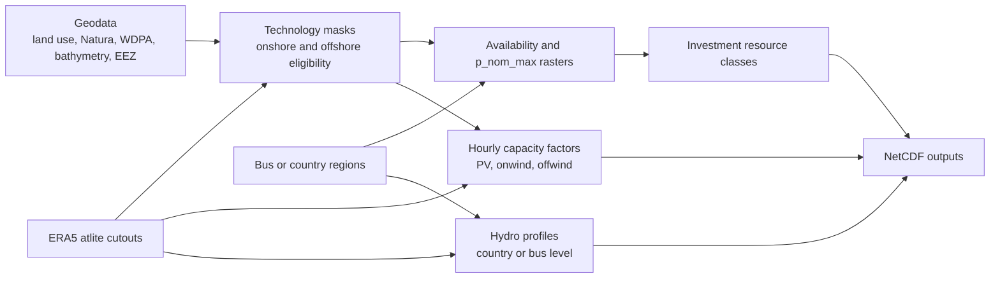

# compute_profiles.py

Standalone script to build renewable capacity factor (CF) time series, availability masks,
resource classes, and hydro profiles from atlite cutouts plus geospatial inputs.

This README explains purpose, inputs, outputs, options, assumptions, and the processing flow.

## Process Flow

## Quick Start

1) Start from the template:
   compute_profiles_config_template.yaml

2) Run:
   python compute_profiles.py --config compute_profiles_config_template.yaml

## Inputs

Core:
- atlite cutouts (NetCDF): cutout_dir/europe-{year}.nc
- output directory: out_dir

Masks / shapes:
- onshore/offshore mask shapes (geojson)
- onshore/offshore region shapes (geojson) for availability_mode=regions
- country shapes (geojson) for hydro aggregation
- optional hydro reduction shapes (geojson) for grouped labels such as A2/A3/A4

Landuse / exclusions:
- CORINE landcover (tif)
- LUISA landcover (tif) + legend (csv)
- Natura2000 raster (tif)
- Ship density raster (nc)
- GEBCO bathymetry (nc)
- WDPA polygons/points (shp)

Hydro:
- plants.csv and buses.csv in NETWORK_DIR (see compute_profiles.py)
- hydro reference file (optional normalization)

## Outputs

CF time series (raster, time,y,x):
- pv/pv_cf_{year}.nc
- onwind/onwind_cf_{year}.nc
- offwind/offwind_cf_{year}.nc

Availability:
- availability_onshore.nc
- availability_offshore.nc
  Includes area_km2, availability_* masks, p_nom_max_* and optional resource classes/bins.

Hydro:
- hydro/hydro_country_profiles_{year}.nc
- hydro/hydro_bus_profiles_{year}.nc (optional; only when bus output is enabled)

## Configuration and Parameters

The script accepts CLI arguments and a YAML config file. YAML keys use underscores and map
directly to CLI arguments. CLI overrides config.

Core:
- start_year, end_year (inclusive)
- cutout_dir, out_dir
- resources: [pv, onwind, offwind, hydro, all]
- masks_out_only: write masks/availability only (skip CF/hydro)
- overwrite: recompute outputs even if they exist

Technology selection:
- onwind_turbine, offwind_turbine:
  atlite turbine names or OEDB via "oedb:<name>"
  Note: OEDB entries require has_power_curve=True.
- clip_p_max_pu: optional CF threshold (0-1). CF values below are set to 0.

Masks and exclusions:
- mask_onshore, mask_offshore
- use_excluder_mask, excluder_res_onshore, excluder_res_offshore
- onshore_mask_shapes, offshore_mask_shapes
- onshore_regions, offshore_regions
- exclude_natura, natura_path
- exclude_shipdensity, shipdensity_path, shipdensity_threshold
- exclude_wdpa_offshore, exclude_wdpa_onshore, wdpa_* filters
- gebco_path, min_depth, max_depth
- min_shore_distance, max_shore_distance
- urban_distance_onwind (buffer around urban codes)

Availability and resource classes:
- availability_mode: raster|regions
- resource_classes (>=1)
- resource_class_mode: global|per-region (per-region requires regions mode)
- resource_class_year

Capacity densities:
- capacity_per_sqkm_pv
- capacity_per_sqkm_onwind
- capacity_per_sqkm_offwind

PyPSA-style defaults:
- pypsa_defaults: apply PyPSA-style landuse, Natura/ship exclusions, offwind constraints
- pypsa_offwind_variant: ac|dc|acdc|float

Hydro:
- hydro_normalize, hydro_normalize_year
- hydro_reference
- hydro_reductions_path
- hydro_write_bus_profiles

## Assumptions and Defaults

- PV panel: CSi (hardcoded)
- PV orientation: latitude_optimal (hardcoded)
- Default capacity densities: PyPSA-style values (5.1/3.0/2.0 MW/km^2)
- Ship density threshold:
  if pypsa_defaults and no explicit shipdensity_threshold:
    400 * 8760 * 6
  else:
    SHIPDENSITY_THRESHOLD (1.0e7)
- Masks are applied to CFs as NaN where excluded.
- Early turbine validation (OEDB/atlite) is performed unless masks_out_only is true.

## Processing Flow (High Level)

1) Parse CLI + YAML config, normalize keys.
2) Validate parameter consistency.
3) Resolve which resources to compute.
4) (Optional) Validate turbines early.
5) Build onshore/offshore masks (raster or ExclusionContainer).
6) Compute availability outputs (raster or per-region).
7) Compute CF time series for PV/onwind/offwind:
   - apply clip_p_max_pu (if set)
   - apply masks
8) Compute hydro profiles (if enabled).
9) Write outputs.

## Examples

Minimal run:
  python compute_profiles.py --config compute_profiles_config_template.yaml

Only masks/availability:
  masks_out_only: true

Apply CF clipping:
  clip_p_max_pu: 0.01

OEDB turbine:
  onwind_turbine: "oedb:Vestas V112-3.45 MW"

## Files

- compute_profiles.py (main script)
- compute_profiles_config_template.yaml (all parameters with comments)
