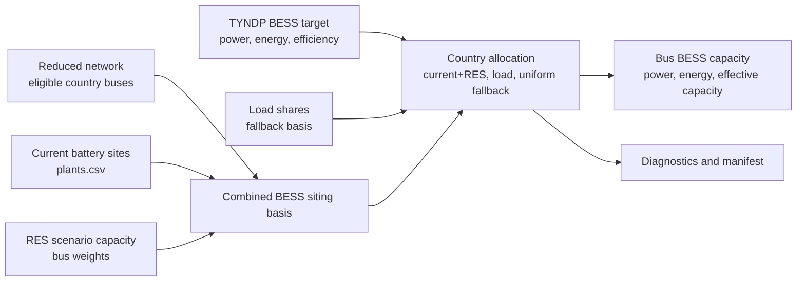

# BESS Preprocessing

Dieses Verzeichnis bereitet nationale BESS-Zielwerte fuer das reduzierte Netz
bus-scharf auf.

Ziel ist, dass das Wartungsmodell keine BESS-Disaggregation mehr intern machen
muss, sondern eine auditierbare Datei aus
`Y:\Group_SEM\MA_Eric\Dissertation\pypsa\opf\bess` einliest.

## Prozessbild



## Skripte

- `bess_disaggregation.py`
  Verteilt nationale BESS-Kapazitaeten auf Busse.
- `run_bess_workflow.py`
  Wrapper fuer den BESS-Schritt.

## Heuristik

Die Verteilung arbeitet je Modellland:

1. Zielwert aus `bess_power_<year>_tyndp2024.csv` lesen.
2. Bereits heute installierte Batterieleistung aus `plants.csv` als erste
   Verteilbasis nutzen.
3. Wenn das nationale Ziel groesser als der heutige Batterie-Bestand ist, den
   Zubau proportional zu den RES-Buskapazitaeten verteilen.
4. Default fuer die RES-Gewichte ist `scenario_capacity_mw` aus
   `res_capacity_bus.csv`.
5. Zulaessig sind nur `(country, bus_id)`-Paare mit positivem `load_share`.
   Reine DC-Converter-Terminals ohne Lastanteil werden ausgeschlossen, auch
   wenn dort RES- oder Batterie-Basisdaten liegen.
6. Wenn es in einem Land keine RES-Gewichte gibt, auf Lastanteile
   zurueckfallen; wenn auch die fehlen, gleichmaessig auf alle Busse des Landes
   verteilen.

Die Ausgabe verwendet `bus_country` standardmaessig, also die Modelllaender des
reduzierten Netzes wie `A2`, `A3` oder `A4`.

## Typische Nutzung

```powershell
python .\run_bess_workflow.py --config .\bess_workflow_2030.yaml
```

Direkt:

```powershell
python .\bess_disaggregation.py --config .\bess_workflow_2030.yaml
```

## Output-Struktur

Standardpfad:

```text
Y:\Group_SEM\MA_Eric\Dissertation\pypsa\opf\bess\
  target_year_<year>\
    <network_case>\
```

Wichtige Dateien:

- `bess_capacity_country_bus.csv`
- `bess_country_targets.csv`
- `bess_current_battery_basis_bus.csv`
- `bess_res_weight_basis_bus.csv`
- `bess_allocation_diagnostics.csv`
- `bess_disaggregation_manifest.json`

`bess_capacity_country_bus.csv` enthaelt sowohl `discharging_power_mw` als auch
`effective_capacity_mw`. Das Wartungsmodell nutzt die effektive Leistung.

## Einbindung ins Wartungsmodell

In `revision_outages/opf/optimization_tyndp_opf.py` gibt es jetzt zusaetzlich
den optionalen Pfad `BESS_DISAGG`. Wenn die Datei
`bess_capacity_country_bus.csv` vorhanden ist, bevorzugt
`prepare_year_inputs(...)` diese bus-scharfe Datei. Sonst bleibt der bisherige
Fallback auf die nationale BESS-CSV aktiv.
