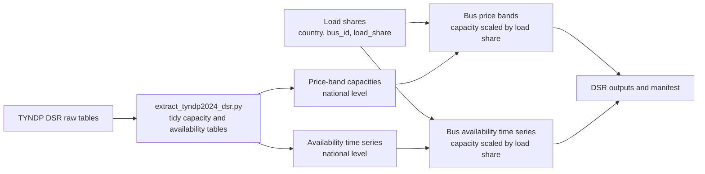

# Demand-Side Response Disaggregation

This directory prepares TYNDP demand-side-response data for the reduced network.
DSR is treated as demand-linked flexibility, so the spatial split follows the
bus load shares from the load workflow.

## Workflow



## Main Scripts

- `extract_tyndp2024_dsr.py`
  converts TYNDP workbook or CSV-style inputs into tidy DSR capacity and
  availability tables.
- `dsr_disaggregation.py`
  maps price-band capacities and available capacities to reduced-grid buses.
- `run_dsr_workflow.py`
  runs extraction and disaggregation for a configured scenario.

## Allocation Logic

The price-band structure is preserved. Installed capacity, available capacity,
and unit counts are multiplied by the bus load share of the corresponding
model country. Prices, activation hours, market node labels, and band IDs are
not re-ranked or merged.

This keeps the national TYNDP flexibility cost structure intact while creating
bus-level data for the UC/OPF model.

## Typical Inputs

- TYNDP DSR source data
- reduced network directory from `grid/`
- load-share file from `load/`
- optional country aggregation and exclusion files

## Typical Outputs

- bus-level DSR price-band capacity table
- bus-level DSR availability time series
- DSR extraction and disaggregation manifests

## Example

```powershell
python .\run_dsr_workflow.py --config .\dsr_workflow_2030.yaml
```
