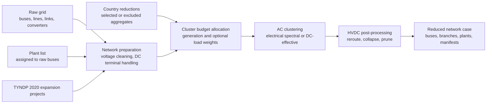

# Reduced Grid And Load Disaggregation Workflow

Dieses Verzeichnis enthaelt einen entkoppelten Workflow fuer

1. Netzreduktion
2. Lastdisaggregation auf die reduzierten Busse

Beide Schritte koennen getrennt voneinander ausgefuehrt werden.

## Prozessbild



## Kurzantwort

Ja, du kannst die Netzreduktion alleine starten und die Ergebnisse ausgeben, ohne direkt danach die Lastdisaggregation laufen zu lassen.

Die Lastdisaggregation ist ein eigener Schritt. Sie braucht nur einen bereits erzeugten `network_dir` mit den relevanten Netzartefakten.

Das bedeutet auch:

- Du kannst ein reduziertes Netz einmal rechnen und spaeter mehrfach fuer verschiedene Lastfaelle verwenden.
- Du kannst unterschiedliche Lastannahmen oder Gewichte (`population_weight`, `gdp_weight`) testen, ohne die Netzreduktion neu zu rechnen.
- Du kannst fuer 2030, 2040 oder andere Zieljahre jeweils eigene YAML-Szenarien anlegen.

## Zielstruktur

```text
opf/
  configs/
    README.md
    pipeline_config.py
    scenarios/
      2030_electrical_spectral_line_equivalent_dc_effective_reactance.yaml
      2030_load_disaggregation.yaml
      2040_electrical_spectral_line_equivalent_dc_effective_reactance.yaml
      2040_load_disaggregation.yaml
  grid/
    grid_reduction.py
  load/
    load_disaggregation_runner.py
```

Die grossen Daten und Outputs liegen nicht im Repo, sondern weiter in der
Arbeitsumgebung auf `Y:`. Empfohlene Datenstruktur dort:

```text
Y:\Group_SEM\MA_Eric\Dissertation\pypsa\opf\
  grid\
  load\
    verification\
```

## Workflow Ueberblick

### Schritt 1: Netzreduktion

`grid/grid_reduction.py` erzeugt ein reduziertes Netz und schreibt die Ergebnisse in einen Szenario-Ausgabeordner.

Typische Outputs im `network_dir` sind:

- `buses.csv`
- `lines.csv`
- `links.csv`
- `converters.csv`
- `transformers.csv`
- `plants.csv`
- `buses_with_clusters.csv`
- `country_group_allocation.csv`
- `cesa_country_clusters.csv`
- `scenario_manifest.json`

Wichtig fuer die Lastdisaggregation sind vor allem:

- `buses.csv`
- `buses_with_clusters.csv`
- `cesa_country_clusters.csv`
- `scenario_manifest.json`

### Schritt 2: Lastdisaggregation

`load/load_disaggregation_runner.py` verteilt Lastzeitreihen auf die Busse eines bereits gerechneten reduzierten Netzes.

Die Lastdisaggregation startet **nicht automatisch** nach der Netzreduktion. Sie wird separat aufgerufen.

Typische Outputs sind:

- `disaggregated_load_country_bus_*.csv`
- `disaggregated_load_country_bus_shares_*.csv`
- `disaggregation_manifest.json`

## Typische Ausfuehrungsarten

### A. Rohes Zieljahr-Netz ohne Reduktion

Wenn du das 2025er Rohnetz nur um die TYNDP-Projekte fuer 2030 oder 2040
erweitern willst, nutzt du den Raw-Only-Modus der bestehenden
`grid/grid_reduction.py`. Dabei wird kein reduziertes Netz gerechnet. Das
Ergebnis ist ein normales `network_dir`, aber mit `cluster_id = bus_id` in
`buses_with_clusters.csv`.

Git-Bash-Aufruf aus `C:/Users/jr8037/bwSyncShare/GITLAB/suc_inertia_fr_model/opf`:

```bash
py="C:/Users/jr8037/AppData/Local/miniforge3/envs/pypsa-eur/python.exe"

"$py" grid/grid_reduction.py \
  --config grid/2030_raw_tyndp2020_network.yaml

"$py" grid/grid_reduction.py \
  --config grid/2040_raw_tyndp2020_network.yaml
```

Die Zielordner sind:

- `C:/Users/jr8037/bwSyncShare/Dissertation/opf/grid/target_year_2030/raw_tyndp2020_network`
- `C:/Users/jr8037/bwSyncShare/Dissertation/opf/grid/target_year_2040/raw_tyndp2020_network`

Diese Ordner koennen anschliessend direkt als `network_dir` fuer Last, RES,
BESS, Hydro und Kraftwerks-Disaggregation verwendet werden. Ein separater
`--raw-network`-Schalter in jedem Disaggregationsskript ist damit nicht noetig;
die Skripte lesen nur ihr Zielnetz.

### B. Nur Netzreduktion

Wenn du nur das reduzierte Netz erzeugen willst:

```bash
py="C:/Users/jr8037/AppData/Local/miniforge3/envs/pypsa-eur/python.exe"

"$py" grid/grid_reduction.py \
  --config grid/2030_128k_allsynch_electrical.yaml
```

Danach kannst du aufhoeren. Die Lastdisaggregation ist optional und kann spaeter folgen.

### C. Nur Lastdisaggregation auf einem vorhandenen Netz

Wenn das reduzierte Netz bereits existiert:

```bash
py="C:/Users/jr8037/AppData/Local/miniforge3/envs/pypsa-eur/python.exe"

"$py" load/load_disaggregation_runner.py \
  --config configs/scenarios/2030_load_disaggregation.yaml
```

Oder direkt mit `--network-dir` und weiteren Overrides:

```bash
"$py" load/load_disaggregation_runner.py \
  --network-dir "C:/Users/jr8037/bwSyncShare/Dissertation/opf/grid/target_year_2030/raw_tyndp2020_network" \
  --load-csv "C:/Users/jr8037/bwSyncShare/Dissertation/opf/load/res_load_country_long_2030_tyndp2024.csv" \
  --nuts3-geojson "C:/Users/jr8037/bwSyncShare/Dissertation/opf/datashapes/nuts3_shapes_pop2021_gdp2024.geojson" \
  --output-dir "C:/Users/jr8037/bwSyncShare/Dissertation/opf/load/target_year_2030/raw_tyndp2020_network"
```

### D. Voller Workflow, aber als zwei getrennte Schritte

```bash
"$py" grid/grid_reduction.py \
  --config grid/2030_128k_allsynch_electrical.yaml

"$py" load/load_disaggregation_runner.py \
  --config configs/scenarios/2030_load_disaggregation.yaml
```

## Aktuelle 2030 Szenarien

Es gibt aktuell vier hinterlegte YAML-Dateien:

- Netzreduktion:
  `configs\scenarios\2030_electrical_spectral_line_equivalent_dc_effective_reactance.yaml`
- Lastdisaggregation:
  `configs\scenarios\2030_load_disaggregation.yaml`
- Netzreduktion:
  `configs\scenarios\2040_electrical_spectral_line_equivalent_dc_effective_reactance.yaml`
- Lastdisaggregation:
  `configs\scenarios\2040_load_disaggregation.yaml`

Damit liegen jetzt sowohl fuer 2030 als auch fuer 2040 konkrete Szenarien vor.

## Was die YAML-Dateien steuern

### Netzreduktion YAML

Wichtige Felder:

- `scenario_name`
- `project_root`
- `target_year`
- `include_tyndp2020`
- `tyndp_base_snapshot_year`
- `output_root`
- `country_reductions_csv`
- `selected_country_cluster_codes`
- `aggregation_modes`
- `similarities`
- `sync_collapse`
- `k_total`
- `load_year`
- `paths.plants`
- `paths.lines`
- `paths.links`
- `paths.buses`
- `paths.converters`
- `paths.transformers`

### Lastdisaggregation YAML

Wichtige Felder:

- `scenario_name`
- `project_root`
- `network_dir`
- `load_csv`
- `load_column`
- `nuts3_geojson`
- `output_dir`
- `population_weight`
- `gdp_weight`
- `distance_alpha`
- `skip_missing_countries`

## 2040 oder andere Szenarien

Fuer 2040 brauchst du **keinen neuen Code**, sondern nur neue YAML-Szenarien mit anderen Pfaden und Parametern.

### Beispiel: 2040 Netzreduktion

Lege z. B. eine Datei an:

```text
configs\scenarios\2040_electrical_spectral_line_equivalent_dc_effective_reactance.yaml
```

Beispielinhalt:

```yaml
scenario_name: 2040_electrical_spectral_line_equivalent_dc_effective_reactance
project_root: Y:\Group_SEM\MA_Eric\Dissertation\pypsa\opf
target_year: 2040
include_tyndp2020: true
tyndp_base_snapshot_year: 2025
output_root: Y:\Group_SEM\MA_Eric\Dissertation\pypsa\opf\grid\target_year_2040
country_reductions_csv: Y:\Group_SEM\MA_Eric\Dissertation\pypsa\opf\country_reductions.csv
selected_country_cluster_codes:
  - A1
  - A2
  - A3
  - A4
  - A6
  - A7
  - A11
aggregation_modes:
  - line_equivalent
similarities:
  - dc_effective_reactance
sync_collapse: true
k_total: 128
load_year: 2025
paths:
  plants: Y:\Group_SEM\MA_Eric\Dissertation\pypsa\opf\powerplants\powerplants.csv
  lines: Y:\Group_SEM\MA_Eric\Dissertation\pypsa\opf\grid\xiong2025 v07\lines.csv
  links: Y:\Group_SEM\MA_Eric\Dissertation\pypsa\opf\grid\xiong2025 v07\links.csv
  buses: Y:\Group_SEM\MA_Eric\Dissertation\pypsa\opf\grid\xiong2025 v07\buses.csv
  converters: Y:\Group_SEM\MA_Eric\Dissertation\pypsa\opf\grid\xiong2025 v07\converters.csv
  transformers: Y:\Group_SEM\MA_Eric\Dissertation\pypsa\opf\grid\xiong2025 v07\transformers.csv
```

Aufruf in Git Bash:

```bash
py="C:/Users/jr8037/AppData/Local/miniforge3/envs/pypsa-eur/python.exe"

"$py" grid/grid_reduction.py \
  --config grid/2040_128k_allsynch_electrical.yaml
```

### Beispiel: 2040 Lastdisaggregation

Lege z. B. eine Datei an:

```text
configs\scenarios\2040_load_disaggregation.yaml
```

Beispielinhalt:

```yaml
scenario_name: 2040_load_disaggregation
project_root: Y:\Group_SEM\MA_Eric\Dissertation\pypsa\opf
network_dir: Y:\Group_SEM\MA_Eric\Dissertation\pypsa\opf\grid\target_year_2040\electrical_spectral_line_equivalent_dc_effective_reactance
load_csv: Y:\Group_SEM\MA_Eric\Dissertation\pypsa\opf\load\res_load_country_long_2040_tyndp2024.csv
load_column: load
nuts3_geojson: Y:\Group_SEM\MA_Eric\Dissertation\pypsa\opf\datashapes\nuts3_shapes_pop2021_gdp2024.geojson
output_dir: Y:\Group_SEM\MA_Eric\Dissertation\pypsa\opf\load\target_year_2040\electrical_spectral_line_equivalent_dc_effective_reactance
population_weight: 0.4
gdp_weight: 0.6
distance_alpha: 1.0
skip_missing_countries: false
```

Aufruf in Git Bash:

```bash
py="C:/Users/jr8037/AppData/Local/miniforge3/envs/pypsa-eur/python.exe"

"$py" load/load_disaggregation_runner.py \
  --config configs/scenarios/2040_load_disaggregation.yaml
```

## Praktische Hinweise

### 1. `network_dir` ist das Handover zwischen beiden Schritten

Die Lastdisaggregation liest aus `network_dir` automatisch:

- `buses.csv`
- `buses_with_clusters.csv`
- `cesa_country_clusters.csv` falls vorhanden

Deshalb ist `network_dir` das zentrale Uebergabeobjekt vom Netzlauf zum Lastlauf.

### 2. Relative Pfade sind moeglich

Die YAML-Pfade werden ueber `configs/pipeline_config.py` aufgeloest. Relative Pfade werden relativ zum Ordner der jeweiligen YAML-Datei interpretiert.

### 3. Mehrere Lastlaeufe auf demselben Netz

Das ist ein zentraler Vorteil der Entkopplung.

Beispiel:

- Einmal 2040 Netz rechnen
- Dann mehrere Lastdisaggregationen auf demselben `network_dir`
- Z. B. mit anderen Lastdateien oder anderen Gewichten

```bash
"$py" load/load_disaggregation_runner.py \
  --network-dir "C:/Users/jr8037/bwSyncShare/Dissertation/opf/grid/target_year_2040/raw_tyndp2020_network" \
  --load-csv "C:/Users/jr8037/bwSyncShare/Dissertation/opf/load/res_load_country_long_2040_variant_a.csv" \
  --population-weight 0.4 \
  --gdp-weight 0.6

"$py" load/load_disaggregation_runner.py \
  --network-dir "C:/Users/jr8037/bwSyncShare/Dissertation/opf/grid/target_year_2040/raw_tyndp2020_network" \
  --load-csv "C:/Users/jr8037/bwSyncShare/Dissertation/opf/load/res_load_country_long_2040_variant_b.csv" \
  --population-weight 0.7 \
  --gdp-weight 0.3
```

### 4. `sync_collapse`

- `sync_collapse: true`
  Externe Synchrongebiete wie `GB`, `IE_NOIE` und `NORDICS` werden jeweils auf einen Sync-Knoten zusammengefuehrt.
- `sync_collapse: false`
  Diese Gebiete laufen ebenfalls durch die `k_total`-Allokation und das Clustering und werden nicht einfach roh durchgereicht.

## Empfohlener Arbeitsstil

Fuer neue Szenarien:

1. Neue Grid-YAML anlegen
2. Netzreduktion rechnen
3. Ergebnisordner pruefen
4. Passende Load-YAML anlegen
5. Lastdisaggregation auf genau diesen `network_dir` laufen lassen

## Minimalbeispiel fuer neue Szenarien

Wenn du 2040 mit einem anderen Netz rechnen willst, musst du typischerweise nur diese Stellen anpassen:

- `target_year`
- `output_root`
- `network_dir`
- `load_csv`
- Input-Pfade unter `paths.*`
- optional `k_total`
- optional `selected_country_cluster_codes`
- optional `sync_collapse`

## Verifikation

Empfohlener Ort fuer Verifikationslaeufe ist:

`Y:\Group_SEM\MA_Eric\Dissertation\pypsa\opf\load\verification\...`

Der eigentliche Produktionslauf schreibt in die in der YAML definierte `output_dir`.
