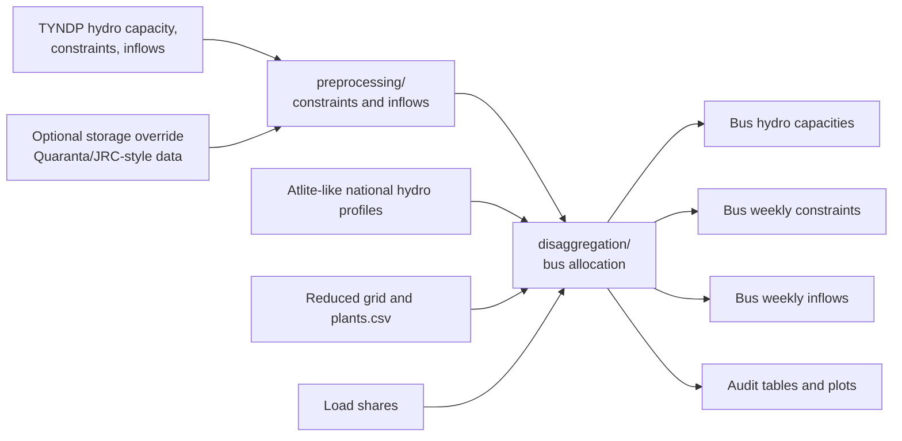

# Hydro Preprocessing and Bus Disaggregation

Hydro is split into two stages. The first stage prepares national or
market-node-level TYNDP constraints and inflows. The second stage maps these
hydro quantities to buses of the reduced network.

## Workflow

## Subdirectories

- [`preprocessing/`](preprocessing/)
  prepares national or market-node hydro capacity, constraint, and inflow
  tables from TYNDP 2024 inputs.
- [`disaggregation/`](disaggregation/)
  allocates hydro capacities, weekly constraints, and weekly inflows to reduced
  network buses.

## Allocation Logic

Hydro bus allocation uses existing hydro turbines and storage capacities from
the reduced network as the primary siting signal. Type shifts between ROR, WR,
and PHS are handled before true residual additions are placed. If no hydro
basis exists for a country, the workflow falls back to load shares.

National or market-zone inflow budgets are distributed across all usable
open-loop units by turbine-capacity shares. This prevents sparse storage
metadata from dropping turbine-only buses. TYNDP inflows are compared with
self-generated national hydro profiles, and missing or unusable TYNDP
combinations can be imputed from these profiles according to documented rules.

Final capacity, constraint, and inflow outputs are aggregated to unique
physical `country_model/bus/plant_type/technology` keys. `source_countries`
preserves the original countries when an aggregate such as A2 combines DE and
LU.

## Typical Outputs

- `disaggregated_hydro_bus_capacities.csv`
- `disaggregated_hydro_bus_constraints_weekly.csv`
- `disaggregated_hydro_bus_inflows_weekly.csv`
- `hydro_bus_allocation_shares.csv`
- `hydro_disaggregation_manifest.json`
- audit tables and plots under `audit/`
