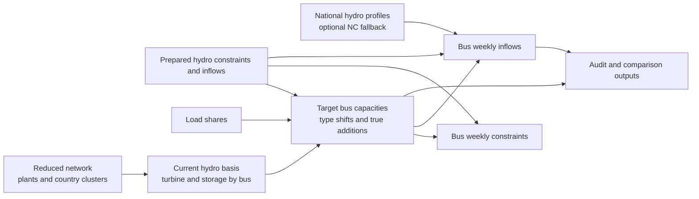

# Hydro Bus Disaggregation

Dieses Verzeichnis enthaelt den Workflow, um nationale TYNDP-Hydrodaten auf die Busse des reduzierten Netzes zu disaggregieren.

Die zentrale Datei ist [hydro_bus_disaggregation.py](hydro_bus_disaggregation.py).

## Zweck

Das Skript erzeugt fuer ein Zieljahr wie `2030` oder `2040`:

- bus-scharfe Hydro-Kapazitaeten
- bus-scharfe Hydro-Constraints
- bus-scharfe Wochenzufluesse je Wetterjahr
- Audit-Tabellen und Vergleichsplots

Die Eingangsseite kombiniert:

- nationale TYNDP-Hydro-Constraints und Inflows
- heutige Hydrostruktur aus dem reduzierten Netz
- disaggregierte Lastdaten fuer Fallback-Allokationen
- reduzierte Laendercluster aus dem aktiven Netzdatensatz
- optionale nationale `nc`/`nc4`-Hydroprofile als Inflow-Fallback

## Prozessbild



## Empfohlene Ausfuehrung

Fuer den NetCDF-Loader sollte die `pypsa-eur`-Umgebung genutzt werden. Dort sind `xarray` und `netCDF4` verfuegbar.

Beispiel:

```powershell
conda run -n pypsa-eur python hydro\hydro_bus_disaggregation.py --config hydro\hydro_bus_disaggregation_config.yaml
```

Ohne Config:

```powershell
conda run -n pypsa-eur python hydro\hydro_bus_disaggregation.py --target-year 2040 --resolve-phs --include-inflows
```

## Ablauf

1. Eingabepfade bestimmen.
   `hydro_dir`, `network_dir`, `load_csv`, `country_profiles_dir` koennen explizit gesetzt oder aus `project_root` und `target_year` abgeleitet werden.

2. Aktive Laenderaggregation laden.
   Das Mapping laeuft ueber `grid/target_year_<year>/.../cesa_country_clusters.csv`.
   Dadurch werden z. B. `UA + MD -> A3`, `RS + XK -> A4`, `DE + LU -> A2` korrekt behandelt.
   Hydro-Laender ohne Kandidatenbus im aktiven Netz und ohne Clusterabbildung werden nicht disaggregiert und als `country_not_in_reduced_network_skipped` im Audit markiert.

3. Bus- und Bestandsgewichte laden.
   Aus `plants.csv` werden heutige Hydro-Kapazitaeten und Speicherkapazitaeten pro Bus gesammelt.
   Diese Busgewichte steuern spaeter die Disaggregation der nationalen TYNDP-Zielwerte.

4. Nationale Constraints vorbereiten.
   Woche `53` wird entfernt.
   Falls eine Technologie nur fuer Woche `1` vorliegt, wird diese Zeile auf Wochen `1..52` repliziert.

5. PHS optional intern aufloesen.
   Die TYNDP-Eingabedateien bleiben unveraendert.
   Wenn `resolve_phs = true`, wird `phs` im Skript wie im urspruenglichen Hydro-Workflow intern umgebogen:

   - `phs/open_loop -> wr/open_loop`
   - `phs/closed_loop -> ror/open_loop`, falls kein `wr`, aber `ror` existiert
   - `phs/closed_loop -> wr/closed_loop`, falls weder `wr` noch `ror` existiert
   - sonst `phs/closed_loop -> wr/open_loop`

   Dabei werden Kapazitaeten und Constraint-Komponenten auf die Zielkombination `(country, plant_type, technology)` aggregiert.

   Wenn `resolve_phs = false`, bleiben `phs/open_loop` und `phs/closed_loop` grundsaetzlich als eigene Zieltechnologien erhalten.
   Es gilt aber eine feste Mischfallregel:

   - wenn ein Land gleichzeitig `phs/open_loop` und `phs/closed_loop` hat, wird `phs/open_loop -> phs/closed_loop` zusammengefuehrt
   - die ehemalige `phs/open_loop`-Kapazitaet bleibt also als `PHS closed_loop` im Modell
   - der ehemalige `phs/open_loop`-Zufluss wird auf `wr/open_loop` und/oder `ror/open_loop` verschoben
   - falls im Land weder `WR` noch `ROR` existieren, wird dieser Zufluss verworfen und das Land hat dann keine Hydro-Technologie mit natuerlichem Zufluss mehr

6. Zielkapazitaeten auf Busse verteilen.
   Pro `country + plant_type + technology` werden:

   - zuerst interne Typverschiebungen innerhalb eines Landes auf bestehende Hydrobusse verteilt
   - erst der verbleibende echte Restzubau auf den Bus mit dem groessten bestehenden Hydroanteil im Land gelegt
   - Speicherkapazitaeten analog mit Speichergewichten und derselben Shift-Logik behandelt

   Falls ein Land noch gar keinen Hydrobestand hat, faellt die Priorisierung ausnahmsweise weiter auf den Lastknoten mit dem groessten Lastanteil im Land bzw. Modellland zurueck.

7. Constraints auf Busse skalieren.
   Leistungs- und Energiefelder werden mit dem Turbinenanteil des Busses skaliert.
   Speicherfelder werden mit dem Speicheranteil skaliert.
   Per-unit-Felder bleiben erhalten.

8. Nationale Inflows aus TYNDP vorbereiten.
   Fuer jede Zieltechnologie und jedes Wetterjahr gilt:

   - Woche `53` wird entfernt
   - Wochenluecken werden linear interpoliert
   - fehlt ein ganzes Wetterjahr, wird es aus dem Wochenmittel der vollstaendigen Jahre imputiert
   - komplette `0`- oder Missing-Pfade werden als Fallbackfaelle markiert

   `closed_loop`-Pfade aus reinem `phs/closed_loop` werden als erwartete Nullzufluesse behandelt.
   Gleiches gilt fuer den zusammengefuehrten `phs/closed_loop`-Fall bei gemischtem `PHS open/closed`.

9. Nationale `nc`/`nc4`-Fallbackprofile laden.
   Das Skript akzeptiert `hydro_country_profiles_<weather_year>.nc` und `.nc4`.
   Es bevorzugt `xarray/netCDF4` und faellt ansonsten auf `ncdump` zurueck.

   Verwendete Variablen:

   - `e_avail_total` fuer nationale Gesamtzufluesse
   - `e_avail(country, hydro_type, time)` fuer technologiespezifische Zufluesse

   Die Werte werden stundenweise zu Wochen `1..52` aggregiert und numerisch in `MWh` gefuehrt.

10. TYNDP-vs-NC-Vergleichsreport erstellen.
    Fuer alle offenen Hydro-Zieltechnologien eines Landes werden Vergleichstabellen und SVGs erzeugt.

11. Inflow-Gruppen bilden.
    Je Land entstehen Gruppen mit Quelle:

    - `tyndp_resolved_open_loop`
    - `nc_tech_missing_combo`
    - `nc_total_missing_combo`
    - `nc_total_closed_loop_override`
    - weitere NC-Fallbackvarianten fuer Sonderfaelle

    Wenn `resolve_phs = true` und ein Land gleichzeitig `closed_loop`-Artefakte und offene Hydrotechnologien enthaelt, kann der gesamte nationale Inflow gezielt auf `nc` umgeschaltet werden.

    Wenn `resolve_phs = false` und ein Land gemischtes `PHS open/closed` hat, wird der `PHS open`-Zufluss nicht mehr an `PHS` vergeben:

    - existieren `WR` und/oder `ROR`, wird der Zufluss als eigene Gruppe auf diese natuerlichen Hydrotechnologien umgelegt
    - existieren keine natuerlichen Hydrotechnologien, wird diese Gruppe verworfen

    Wenn `resolve_phs = false` und `phs/open_loop` als eigene offene Zieltechnologie erhalten bleibt, kann ein fehlender oder komplett `0`-Pfad aus TYNDP direkt durch das technologiespezifische `nc`-Profil `phs` ersetzt werden. Falls dieses nicht verfuegbar ist, faellt der Workflow auf `e_avail_total` des Landes zurueck.

12. Inflows auf Busse verteilen.
    Die Gruppen werden je Land auf Busse verteilt:

    - zuerst nach Gesamt-Speicheranteilen am Bus
    - falls kein Speicher vorhanden ist, nach Gesamt-Turbinenleistung
    - innerhalb eines Busses danach zwischen den zugelassenen Technologien nach Turbinenanteilen

    `closed_loop` bekommt keinen natuerlichen Zufluss.

## Parameter

Unterstuetzte CLI-Optionen:

- `--config`
  YAML-Konfiguration. CLI-Werte uebersteuern die Config.
- `--target-year`
  Zieljahr, aktuell typischerweise `2030` oder `2040`.
- `--project-root`
  Projektwurzel. Standard ist das aktuelle Arbeitsverzeichnis.
- `--hydro-dir`
  Verzeichnis mit den nationalen TYNDP-Hydro-CSVs.
- `--network-dir`
  Reduzierter Netzdatensatz fuer das Zieljahr.
- `--load-csv`
  Disaggregierte Lastdatei. Falls nicht gesetzt, wird sie automatisch gesucht.
- `--output-dir`
  Zielordner fuer die erzeugten Dateien.
- `--country-clusters-csv`
  Aktive Clusterzuordnung des reduzierten Netzes.
- `--country-reductions-csv`
  Referenzdatei mit moeglichen Laenderreduktionen.
- `--country-profiles-dir`
  Verzeichnis mit den nationalen Hydroprofilen `hydro_country_profiles_<weather_year>.nc/.nc4`.
- `--resolve-phs` / `--no-resolve-phs`
  PHS intern zu `WR/ROR` aufloesen oder als `PHS` beibehalten.
- `--include-inflows` / `--no-include-inflows`
  Zuflusslogik einschalten oder gezielt deaktivieren.
- `--audit-only` / `--no-audit-only`
  Nur Audit bzw. voller Workflow.

## YAML-Konfiguration

Das Skript unterstuetzt eine YAML-Datei ueber `--config`.

Unterstuetzt werden:

- top-level Keys
- optional `common`
- optional `disaggregation`
- optional `hydro_bus_disaggregation`
- optional `run`

Merge-Reihenfolge:

1. interne Defaults
2. top-level Keys aus YAML
3. `common`
4. `disaggregation`
5. `hydro_bus_disaggregation`
6. `run`
7. explizite CLI-Argumente

Relative Pfade in der YAML werden relativ zur YAML-Datei aufgeloest.

Beispiel siehe [hydro_bus_disaggregation_config.yaml](hydro_bus_disaggregation_config.yaml).

## Outputs

Im `output_dir` entstehen typischerweise:

- `disaggregated_hydro_bus_capacities.csv`
- `disaggregated_hydro_bus_constraints_weekly.csv`
- `disaggregated_hydro_bus_inflows_weekly.csv`
- `hydro_bus_allocation_shares.csv`
- `hydro_disaggregation_manifest.json`

`hydro_bus_allocation_shares.csv` enthaelt je Hydro-Zielkombination alle Lastbusse des jeweiligen Landes bzw. Modellclusters. Nicht allokierte Lastbusse werden explizit mit `turbine_share = 0`, `storage_share = 0` und `allocation_rule = zero_share_candidate_bus` ausgegeben. Reine DC-/HVDC-Hilfsbusse wie `cl_dc...` werden dadurch nicht als Null-Share-Busse aufgefuellt.

Im Unterordner `audit`:

- `hydro_capacity_gap_by_country_tech.csv`
- `hydro_current_vs_target_country_plant_type.csv`
- `hydro_current_vs_target_country_total.csv`
- `hydro_current_vs_target_country_type_shift_signature.csv`
- `hydro_inflow_quality_by_country_tech.csv`
- `hydro_review_flags.csv`
- `hydro_turbine_gap_top20.svg`
- `hydro_total_hydro_delta_turb_top20.svg`
- `hydro_internal_type_shift_turb_top20.svg`
- `hydro_mean_weekly_bus_inflow_by_plant_type.svg`
- `hydro_tyndp_vs_nc_country_summary.csv`
- `hydro_tyndp_vs_nc_country_weather_year.csv`
- `hydro_tyndp_vs_nc_country_tech_summary.csv`
- `hydro_tyndp_vs_nc_country_tech_weekly_means.csv`
- `hydro_tyndp_vs_nc_mean_annual_diff_top20.svg`
- `hydro_tyndp_vs_nc_mean_weekly_total.svg`

## Hinweise

- Fuer `2030` und `2040` muessen sowohl reduzierte Netzdatensaetze als auch Lastoutputs vorhanden sein.
- Die aktuelle Busgewichtung fuer Hydrobestand basiert auf `plants.csv`.
- Der NC-Vergleich und der NC-Fallback sind national bzw. technologiebezogen, nicht busbezogen.
- Nationale bzw. marktgebietsbezogene Zuflussbudgets werden ueber positive
  Turbinenkapazitaeten auf alle offenen Hydroeinheiten verteilt. Dadurch fallen
  reine Turbinenbusse bei lueckenhaften Speicherdaten nicht aus der Zuflussdatei.
- Die finalen Kapazitaets-, Restriktions- und Zuflussdateien besitzen eindeutige
  physische `country_model/bus/plant_type/technology`-Schluessel. Bei
  Laenderaggregaten dokumentiert `source_countries` die zusammengefuehrten
  Ursprungslaender.
- Die Audit-Tabellen `hydro_current_vs_target_country_total.csv` und `hydro_current_vs_target_country_type_shift_signature.csv` helfen dabei, reine Technologieverschiebungen zwischen `ROR`, `WR` und `PHS` von echtem Zubau oder Rueckbau zu trennen.
- Die Kapazitaetsallokation nutzt diese Trennung jetzt direkt: moegliche Typverschiebungen werden vor echtem Neubau auf bestehende Hydrobusse gelegt; nur der verbleibende Restzubau geht auf den hydrostaerksten Bus des Landes.
- Wenn `resolve_phs = false`, wird fuer reine `phs/open_loop`-Faelle bei fehlenden oder komplett `0`-TYNDP-Zufluessen ein technologiespezifischer NC-Fallback ueber `hydro_type = phs` genutzt. Falls kein `phs`-Profil vorliegt, wird auf das nationale NC-Gesamtprofil zurueckgegriffen.
- Fuer gemischte `phs/open_loop + phs/closed_loop`-Laender wird `phs/open_loop` dagegen automatisch zu `phs/closed_loop` zusammengefuehrt und der ehemalige Zufluss auf `WR/ROR` verschoben oder ohne `WR/ROR` verworfen.
- Wenn das Skript ausserhalb von `pypsa-eur` laeuft, funktioniert der NetCDF-Zugriff weiterhin ueber `ncdump`, ist aber deutlich langsamer.
