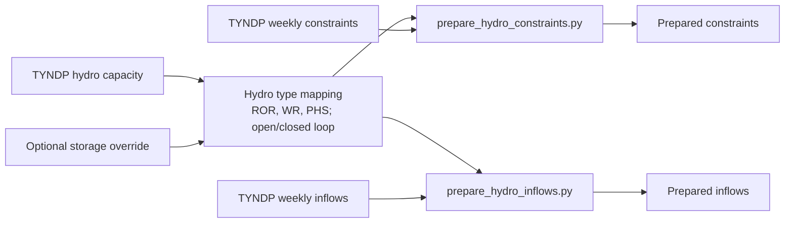

# TYNDP2024 Hydro Workflow

## Zweck

In diesem Verzeichnis liegen die Hydro-Rohdaten aus TYNDP2024 sowie die finalen Python-Skripte zur Aufbereitung fuer zwei Anwendungsfaelle:

1. `Constraints` je Land oder Market Node und Hydro-Technologie
2. `Inflows` je Land oder Market Node, Hydro-Technologie, Wetterjahr und Woche

## Prozessbild



Die finale Version des Workflows kann optional Speicherkapazitaeten aus der Datei

`Y:\Group_SEM\MA_Eric\Dissertation\DATA\hydro\quaranta2024\hydro_capacity_2025_quaranta.csv`

uebernehmen. Dabei werden strikt nur Zeilen mit Quelle `Quaranta et al. 2024` verwendet. Zeilen aus `JRC Hydro Database` werden ignoriert.

## Finale Dateien

Die folgenden Dateien sind die aktuell benoetigten Skripte:

- `hydro_commons.py`
- `prepare_hydro_constraints.py`
- `prepare_hydro_inflows.py`
- `hydro_workflow_config.yaml`

Die CSV-Dateien `hydro_power_capacity_*`, `hydro_uniform_constraints_*` und `hydro_inflow_profiles_*` sind die Eingabedaten. Alte `hydro_capacities_country_*`-Dateien werden weiterhin als Fallback unterstuetzt, aber nur fuer `region_level: country`.

## Eingabedaten

### TYNDP2024 im aktuellen Verzeichnis

- `hydro_power_capacity_2030_tyndp2024.csv`
- `hydro_power_capacity_2040_tyndp2024.csv`
- `hydro_power_capacity_2050_tyndp2024.csv`
- `hydro_uniform_constraints_weekly_country_2030_tyndp2024.csv`
- `hydro_uniform_constraints_weekly_country_2040_tyndp2024.csv`
- `hydro_uniform_constraints_weekly_market_node_2030_tyndp2024.csv`
- `hydro_uniform_constraints_weekly_market_node_2040_tyndp2024.csv`
- `hydro_inflow_profiles_weekly_country_2030_tyndp2024.csv`
- `hydro_inflow_profiles_weekly_country_2040_tyndp2024.csv`
- `hydro_inflow_profiles_weekly_market_node_2030_tyndp2024.csv`
- `hydro_inflow_profiles_weekly_market_node_2040_tyndp2024.csv`

Hinweis:

- Die Skripte filtern immer nach `ref_year`.
- Die Dateinamen sind daher nicht die fachliche Wahrheit. Auch Dateien mit `2030` im Namen koennen weitere `ref_year` enthalten.

### Externe Override-Datei

- `Y:\Group_SEM\MA_Eric\Dissertation\DATA\hydro\quaranta2024\hydro_capacity_2025_quaranta.csv`

Diese Datei enthaelt:

- `country`
- `plant_type`
- `technology_type`
- `capacity_gwh`
- `capacity_mwh`
- `source`

Nur Eintraege mit `source = Quaranta et al. 2024` werden uebernommen.

## YAML-Konfiguration

Beide Workflows koennen statt vieler CLI-Argumente ueber eine gemeinsame YAML-Datei gestartet werden:

```powershell
python ".\\prepare_hydro_constraints.py" --config ".\\hydro_workflow_config.yaml"
python ".\\prepare_hydro_inflows.py" --config ".\\hydro_workflow_config.yaml"
```

Unterstuetztes Muster:

- top-level Keys fuer globale Defaults
- optionaler Block `common`
- optionaler Block `constraints`
- optionaler Block `inflows`

Merge-Reihenfolge:

1. interne Defaults der Skripte
2. top-level Keys in der YAML
3. `common`
4. `constraints` oder `inflows`
5. explizite CLI-Argumente

Wichtige Regeln:

- `year` bleibt fachlich Pflicht, kann aber jetzt aus der YAML kommen.
- `region_level` steuert die raeumliche Granularitaet: `country` oder `market_node`.
- Relative Pfade fuer `base_dir` und `storage_override_csv` werden relativ zur YAML-Datei aufgeloest.
- Relative Pfade fuer `output` bleiben wie bisher relativ zu `base_dir`.
- Absolute Pfade fuer `output` sind ebenfalls erlaubt.
- Das eingebaute YAML-Parsing ist bewusst schlank: einfache `key: value`-Mappings mit 2 Leerzeichen Einrueckung, ohne Listen.
- Boolesche YAML-Werte koennen mit CLI bei Bedarf wieder ueberschrieben werden, z. B. `--no-resolve-phs-to-wr`.

Beispiel:

```yaml
common:
  year: 2030
  base_dir: Y:\Group_SEM\MA_Eric\Dissertation\DATA\raw\hydro\tyndp2024
  region_level: country
  resolve_phs_to_wr: true
  use_default_storage_overrides: true

constraints:
  temporal_resolution: weekly
  output: hydro_constraints_country_weekly_2030_quaranta_only_phs_as_wr.csv

inflows:
  weather_year_start: 1982
  weather_year_end: 2016
  output: hydro_inflows_country_weekly_2030_quaranta_only_phs_as_wr.csv
```

Die Datei `hydro_workflow_config.yaml` enthaelt dieselbe Vorlage.

## Datenlogik und Annahmen

### Hydro-Typen

Die TYNDP-Daten verwenden:

- `phs` = Pumped Hydro Storage
- `wr` = Water Reservoir
- `ror` = Run-of-River

Technologien:

- `open_loop`
- `closed_loop`

### Mapping neue Capacity-Datei

Die neuen Dateien `hydro_power_capacity_<year>_tyndp2024.csv` sind semikolon-separiert und enthalten `country` und `zone` gemeinsam. `zone` wird im Workflow als `market_node` verwendet.

Mapping:

- `Hydro - Run of River (Turbine)` -> `ror/open_loop`
- `Hydro - Pondage (Turbine)` -> `ror/open_loop`
- `Hydro - Reservoir (Turbine)` -> `wr/open_loop`
- `Hydro - Pump Storage Open Loop (...)` -> `phs/open_loop`
- `Hydro - Pump Storage Closed Loop (...)` -> `phs/closed_loop`

Leistungs- und Speicherlogik:

- `power_type = Turbine` wird als `turb_mw` uebernommen.
- `power_type = Pumping` wird als positive Magnitude in `pump_mw` uebernommen.
- `capacity_mwh` wird in `storage_gwh` umgerechnet.
- PHS-Speicher steht in Turbine- und Pumping-Zeilen gespiegelt und wird deshalb je Pump-Storage-Komponente nur einmal gezaehlt.
- Ausgeschriebene Laendernamen in der Capacity-Datei werden auf ISO-A2 normalisiert, z. B. `Ukraine -> UA`, `Moldova -> MD`, `Egypt -> EG`.
- Bei `region_level: country` werden alle Zonen eines Landes aggregiert.
- Bei `region_level: market_node` bleiben `country` und `market_node` separat im Output.

### Fehlende Constraint-Zeitreihen

Wenn eine aktive Hydro-Technologie in `hydro_power_capacity_*` existiert, aber in den woechentlichen Constraint-Rohdaten fuer diese Region fehlt, wird sie im Constraint-Output ergaenzt.

Logik:

- Die Imputation gilt fuer alle betroffenen Regionen, nicht fuer einzelne hartkodierte Laender.
- Fuer Turbinen-/Pump-Leistung und Tagesenergie wird je `plant_type`, `technology` und Woche die mittlere relative Verfuegbarkeit aller vorhandenen anderen Regionen gebildet.
- Diese relative Verfuegbarkeit wird auf die installierte Kapazitaet der fehlenden Region zurueckskaliert.
- Reservoir-Grenzen werden als dimensionslose Wochenmittel derselben Technologie uebernommen.
- Leistungs- und Energie-Constraints werden physikalisch auf die installierte Leistung bzw. `installierte Leistung * 24 h` begrenzt; Reservoir-Level werden auf `[0, 1]` begrenzt.
- Vorhandene Constraint-Zeilen mit einzelnen leeren Feldern werden nur dann feldweise mit dieser Heuristik aufgefuellt, wenn `impute_missing_constraint_fields: true` gesetzt ist.
- Die Output-Spalte `imputed` markiert `no` fuer unveraenderte Rohdatenzeilen, `yes` fuer vorhandene Zeilen mit feldweise imputierten Feldern und `other` fuer komplett fehlende Region-/Technologie-Zeitreihen.
- Inflow-Zeitreihen werden nicht ueber TYNDP-Mittelwerte imputiert; fehlende Inflows bleiben fuer eine spaetere Ergaenzung aus nationalen atlite-Profilen offen.

### Mapping Quaranta -> TYNDP

In der Override-Datei wird wie folgt gemappt:

- `Hydro Pumped Storage` -> `phs`
- `Hydro Water Reservoir` -> `wr`
- `GB` -> `UK`

Es werden nur `phs` und `wr` ersetzt. `ror` bleibt unveraendert.

### Was ersetzt wird

Die Override-Datei enthaelt nur Speicherkapazitaeten.

Ersetzt wird deshalb nur:

- `storage_gwh` in den Kapazitaetsdaten
- daraus abgeleitet `installed_storage_mwh` in den Outputs

Nicht ersetzt werden:

- `turb_mw`
- `pump_mw`
- alle Constraints selbst
- alle Inflow-Werte

### Verteilung ueber Technologien

Quaranta liefert Speicherkapazitaeten je Land und Plant Type, nicht je `open_loop` / `closed_loop`.

Deshalb gilt:

- Falls TYNDP fuer ein Land und einen Plant Type bereits positive Speicherwerte ueber mehrere Technologie-Zeilen hat, wird die Quaranta-Summe proportional zur bestehenden TYNDP-Verteilung auf diese Zeilen verteilt.
- Falls TYNDP fuer diesen Plant Type insgesamt `0` Speicher hat, wird der Override auf `open_loop` gelegt, falls vorhanden, sonst auf die erste verfuegbare Zeile.

### PHS auf WR aufloesen

Mit `--resolve-phs-to-wr` wird `phs` in `wr/open_loop` integriert:

- PHS-Zeilen verschwinden aus dem Output
- Turbinenleistung und Speicherkapazitaet werden zu `wr` addiert
- Pumpen wird auf `0` gesetzt
- Reservoir-Grenzen werden speichergewichtet gemittelt
- Falls vorher kein `wr` existiert, wird `phs` zu `wr` umgeformt

### Zeitlogik

Die Constraint-Dateien sind woechentlich.

Im `daily`-Modus gilt:

- jede Woche wird auf ihre Kalendertage im Zieljahr expandiert
- Woche 53 wird auf die real verbleibenden Tage des Jahres gekuerzt
- Wochenwerte werden fuer alle Tage dieser Woche konstant wiederholt

Im `weekly`-Modus gilt:

- eine Zeile je Woche
- zusaetzlich werden `period_start_date`, `period_end_date` und `days_in_period` geschrieben
- taegliche Energiewerte werden auch als Periodensummen `*_mwh_period` ausgegeben

### Vorzeichen fuer Pumpen

In den TYNDP-Constraints koennen Pumpwerte negativ sein. Die Skripte geben Pump-Leistungen und Pump-Energien als positive Magnituden aus:

- `max_pump_mw`
- `min_pump_mw`
- `max_pump_en_mwh_day`
- `min_pump_en_mwh_day`

## Skript 1: Constraints

Datei:

- `prepare_hydro_constraints.py`

### Funktion

Erzeugt Constraints je Land und Hydro-Technologie fuer ein Zieljahr.

Unterstuetzte Modi:

- `daily`
- `weekly`

### Parameter

- `--config` optionale YAML-Datei mit `common` und `constraints`
- `--year` Pflichtparameter, `ref_year`, falls nicht ueber YAML gesetzt
- `--base-dir` Verzeichnis mit den TYNDP-Hydro-CSV-Dateien
- `--output` optionaler Ausgabepfad
- `--region-level` `country` oder `market_node`
- `--temporal-resolution` `daily` oder `weekly`
- `--resolve-phs-to-wr` optional
- `--no-resolve-phs-to-wr` ueberschreibt YAML/CLI wieder auf `false`
- `--impute-missing-constraint-fields` fuellt einzelne leere Felder vorhandener Constraint-Zeilen ueber die Wochen-/Technologie-Heuristik
- `--no-impute-missing-constraint-fields` deaktiviert diese feldweise Imputation explizit
- `--use-default-storage-overrides` verwendet die bekannte Quaranta-Datei und filtert auf `Quaranta et al. 2024`
- `--no-default-storage-overrides` deaktiviert den Default-Override explizit
- `--storage-override-csv` alternative Override-Datei im Quaranta-Format

### Standard-Ausgabename

Ohne Override:

- `hydro_constraints_country_<resolution>_<year>.csv`

Mit Quaranta-Override:

- `hydro_constraints_country_<resolution>_<year>_quaranta_only.csv`

Mit Quaranta-Override und PHS-Aufloesung:

- `hydro_constraints_country_<resolution>_<year>_quaranta_only_phs_as_wr.csv`

### Output-Spalten im daily-Modus

- `country`
- `ref_year`
- `plant_type`
- `technology`
- `temporal_resolution`
- `week`
- `day_of_week`
- `day_of_year`
- `date`
- `installed_turb_mw`
- `installed_pump_mw`
- `installed_storage_mwh`
- `min_turb_mw`
- `max_turb_mw`
- `min_turb_pu`
- `max_turb_pu`
- `min_pump_mw`
- `max_pump_mw`
- `min_pump_pu`
- `max_pump_pu`
- `min_turb_en_mwh_day`
- `max_turb_en_mwh_day`
- `min_pump_en_mwh_day`
- `max_pump_en_mwh_day`
- `min_res_hist_pu`
- `max_res_hist_pu`
- `min_res_tech_pu`
- `max_res_tech_pu`

### Output-Spalten im weekly-Modus

- `country`
- `ref_year`
- `plant_type`
- `technology`
- `temporal_resolution`
- `week`
- `period_start_date`
- `period_end_date`
- `days_in_period`
- `installed_turb_mw`
- `installed_pump_mw`
- `installed_storage_mwh`
- `min_turb_mw`
- `max_turb_mw`
- `min_turb_pu`
- `max_turb_pu`
- `min_pump_mw`
- `max_pump_mw`
- `min_pump_pu`
- `max_pump_pu`
- `min_turb_en_mwh_day`
- `max_turb_en_mwh_day`
- `min_pump_en_mwh_day`
- `max_pump_en_mwh_day`
- `min_turb_en_mwh_period`
- `max_turb_en_mwh_period`
- `min_pump_en_mwh_period`
- `max_pump_en_mwh_period`
- `min_res_hist_pu`
- `max_res_hist_pu`
- `min_res_tech_pu`
- `max_res_tech_pu`

### Beispiele

```powershell
python ".\\prepare_hydro_constraints.py" --config ".\\hydro_workflow_config.yaml"
python ".\\prepare_hydro_constraints.py" --config ".\\hydro_workflow_config.yaml" --temporal-resolution daily
python ".\\prepare_hydro_constraints.py" --year 2030 --temporal-resolution weekly
python ".\\prepare_hydro_constraints.py" --config ".\\hydro_workflow_config.yaml" --year 2040 --no-resolve-phs-to-wr
```

## Skript 2: Inflows

Datei:

- `prepare_hydro_inflows.py`

### Funktion

Erzeugt woechentliche Inflows je Land, Hydro-Technologie und Wetterjahr.

### Parameter

- `--config` optionale YAML-Datei mit `common` und `inflows`
- `--year` Pflichtparameter, `ref_year`, falls nicht ueber YAML gesetzt
- `--base-dir` Verzeichnis mit den TYNDP-Hydro-CSV-Dateien
- `--output` optionaler Ausgabepfad
- `--region-level` `country` oder `market_node`
- `--resolve-phs-to-wr` optional
- `--no-resolve-phs-to-wr` ueberschreibt YAML/CLI wieder auf `false`
- `--weather-year-start` Default `1982`
- `--weather-year-end` Default `2016`
- `--use-default-storage-overrides` verwendet die bekannte Quaranta-Datei und filtert auf `Quaranta et al. 2024`
- `--no-default-storage-overrides` deaktiviert den Default-Override explizit
- `--storage-override-csv` alternative Override-Datei im Quaranta-Format

### Standard-Ausgabename

Ohne Override:

- `hydro_inflows_country_weekly_<year>.csv`

Mit Quaranta-Override:

- `hydro_inflows_country_weekly_<year>_quaranta_only.csv`

Mit Quaranta-Override und PHS-Aufloesung:

- `hydro_inflows_country_weekly_<year>_quaranta_only_phs_as_wr.csv`

### Output-Spalten

- `country`
- `ref_year`
- `weather_year`
- `week`
- `plant_type`
- `technology`
- `installed_turb_mw`
- `installed_pump_mw`
- `installed_storage_mwh`
- `inflow_mwh_week`

### Beispiele

```powershell
python ".\\prepare_hydro_inflows.py" --config ".\\hydro_workflow_config.yaml"
python ".\\prepare_hydro_inflows.py" --config ".\\hydro_workflow_config.yaml" --weather-year-start 1985 --weather-year-end 2010
python ".\\prepare_hydro_inflows.py" --year 2030 --use-default-storage-overrides --resolve-phs-to-wr
python ".\\prepare_hydro_inflows.py" --config ".\\hydro_workflow_config.yaml" --year 2040 --no-default-storage-overrides
```

## Gemeinsames Hilfsmodul

Datei:

- `hydro_commons.py`

Inhalte:

- robustes Laden aller relevanten Country-CSV-Dateien
- Filterung nach `ref_year`
- Duplikaterkennung
- Wochen-zu-Tage-Expansion
- PHS-zu-WR-Aggregation
- CSV-Schreiben

## Typische Workflows

### 1. Constraints auf Tagesebene mit Quaranta-Speichern

```powershell
python ".\\prepare_hydro_constraints.py" --config ".\\hydro_workflow_config.yaml" --temporal-resolution daily
```

### 2. Constraints auf Wochenebene mit Quaranta-Speichern und PHS-Aufloesung

```powershell
python ".\\prepare_hydro_constraints.py" --config ".\\hydro_workflow_config.yaml"
```

### 3. Inflows mit Quaranta-Speichern

```powershell
python ".\\prepare_hydro_inflows.py" --config ".\\hydro_workflow_config.yaml"
```

## Hinweise und Grenzen

- Die Quaranta-Datei ersetzt nur Speicherkapazitaeten, keine MW-Leistungen.
- Nur Zeilen mit Quelle `Quaranta et al. 2024` werden uebernommen.
- JRC-Zeilen in derselben CSV werden ignoriert.
- Nicht alle Laender und Plant Types sind in Quaranta enthalten. Fehlende Kombinationen bleiben auf TYNDP.
- `GB` wird auf `UK` gemappt.
- Leere Constraint-Felder in TYNDP bleiben leer.
- `res_level_day` aus TYNDP wird bewusst nicht verwendet.

## Pflege

Falls kuenftig eine neue Override-Datei verwendet werden soll, gibt es zwei Wege:

1. `--storage-override-csv` auf eine alternative Datei setzen, solange sie dasselbe Quaranta-Format hat.
2. Die Override-Logik in `prepare_hydro_constraints.py` und `prepare_hydro_inflows.py` anpassen, falls sich Feldnamen, Quellenbezeichnung oder Mapping aendern.
