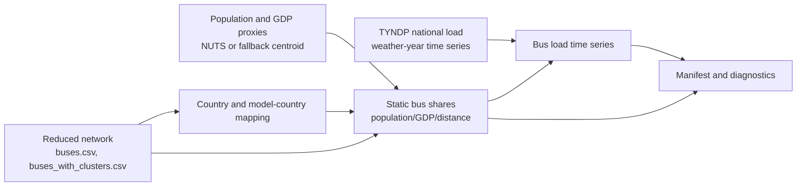

# Load Disaggregation

This directory contains the load regionalisation step. It maps national TYNDP
load time series to buses of an already prepared grid case. The same static
load shares are reused later as fallback or eligibility information by DSR,
thermal units, other non-RES, BESS, and hydro.

## Workflow



## Main Script

- `load_disaggregation_runner.py`
  reads the reduced network, socioeconomic proxy regions, and national load
  data; computes country-specific bus shares; and applies these shares to the
  load time series.
- `build_nuts3_proxies.py`
  prepares NUTS-level proxy geometries with population and GDP attributes.

## Allocation Logic

For each source or model country, the script builds proxy weights from
population and GDP. Each proxy region is distributed over candidate buses by
inverse-distance weights. Population-based and GDP-based bus shares are kept as
diagnostics and then blended with configurable weights.

If no external proxy region exists for a country, the script creates a neutral
fallback proxy at the mean bus location. This avoids silently dropping load for
small or aggregated model countries.

## Typical Inputs

- reduced network directory from `grid/`
- national TYNDP load CSV
- NUTS proxy GeoJSON with population and GDP
- optional `cesa_country_clusters.csv`
- optional `excluded_countries.csv`

## Typical Outputs

- `disaggregated_load_country_bus_*.csv`
- `disaggregated_load_country_bus_shares_*.csv`
- `disaggregation_manifest.json`

## Example

```powershell
python .\load_disaggregation_runner.py --config .\2030_load_disaggregation.yaml
```

The output shares file is a central handover to several downstream modules. If
the network case changes, regenerate the load shares for exactly that
`network_dir`.
