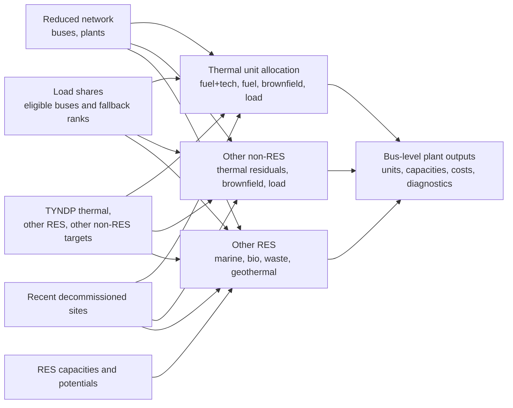

# Powerplants Preprocessing

Dieses Verzeichnis enthaelt die vorgelagerte Aufbereitung von Kraftwerksdaten fuer
das Wartungsmodell.

Ziel ist, dass das Wartungsmodell keine Disaggregation von Kraftwerksdaten mehr
selbst durchfuehrt, sondern bus-scharfe, auditierbare Datensaetze aus
`Y:\Group_SEM\MA_Eric\Dissertation\pypsa\opf\powerplants` einliest.

## Prozessbild



## Skripte

- `thermal_disaggregation.py`
  Disaggregiert nationale TYNDP-Thermalkapazitaeten auf Busse des reduzierten
  Netzes. Die Heuristik nutzt die im Netzfall enthaltene thermische
  Bestandsstruktur aus `plants.csv` und faellt bei fehlenden Treffern auf eine
  country-spezifische Busreihenfolge zurueck.
- `other_nonres_disaggregation.py`
  Behandelt `Other non-RES` als kleine Oel-/Gas-Peaker und verteilt sie ueber
  thermische Restbasis, dekommissionierte Standorte und zuletzt Lastanteile.
- `other_res_disaggregation.py`
  Verteilt `Other RES` nach Technologie: Bio/Waste/Geothermal ueber passende
  PyPSA-Basis, dekommissionierte Standorte und Round-Robin; `Marine` ueber
  Offshore-Wind-Eignung; undefinierte Technologien nur per Round-Robin.
- `run_powerplants_workflow.py`
  Wrapper fuer die drei Schritte.
- `powerplants_common.py`
  Gemeinsame IO-, Pfad-, Country- und Validierungshelfer.

## Typische Nutzung

```powershell
python .\run_powerplants_workflow.py --config .\powerplants_workflow_2030.yaml
```

Einzelne Schritte:

```powershell
python .\thermal_disaggregation.py --config .\powerplants_workflow_2030.yaml
python .\other_nonres_disaggregation.py --config .\powerplants_workflow_2030.yaml
python .\other_res_disaggregation.py --config .\powerplants_workflow_2030.yaml
```

## Erwartete Inputs

- Netzfall aus `grid/target_year_<year>/<network_case>/`
  - `buses.csv`
  - `plants.csv`
  - `buses_with_clusters.csv`
- Nationale TYNDP-Kapazitaeten:
  - `thermal_<year>_tyndp2024.csv`
  - `Other RES` und `Other non-RES` kommen standardmaessig aus
    `Y:\Group_SEM\MA_Eric\Dissertation\DATA\raw\others\tyndp2024`
  - Wenn `other_res_csv` oder `other_nonres_csv` in der YAML leer bleibt,
    sucht der jeweilige Schritt im `others_input_dir` nach einer passenden CSV
    fuer Zieljahr und Technologie.
  - `NI`, `UA` und `MD` werden als eigenstaendige Modelllaender behandelt.
    Insbesondere wird `NI` nicht auf `GB`/`UK` gemappt.
- Revisionsdauer-Tabellen
  - `plants_median_revision_duration_weeks_country_2015-2025_planned.csv`
  - `plants_max_revision_duration_weeks_country_2015-2025_planned.csv`
- Lastanteile aus dem Load-Workflow, z. B.
  `load/target_year_<year>/<network_case>/disaggregated_load_country_bus_shares_load_pop40_gdp60.csv`
  Diese Datei definiert zugleich die harte Bus-Zulaessigkeit: Thermal,
  `Other RES` und `Other non-RES` werden nur auf `(country, bus_id)`-Paare
  mit positivem `load_share` gelegt. Busse ohne Lastanteil, z. B. reine
  DC-Converter-Terminals, werden auch dann ausgeschlossen, wenn dort
  Kraftwerks- oder RES-Headroom-Daten liegen.
- RES-Kapazitaetsdaten aus dem Renewables-Workflow
  - `res_capacity_bus.csv`
  - optional eine bus-scharfe Potentialtabelle mit
    `bus_id;country;technology;p_nom_max_mw`
  - alternativ `res_capacity_cells.nc` plus `res_bus_lookup.csv`, woraus das
    Skript die Potentiale fuer `pv` und `onwind` aggregiert

## Output-Struktur

Standardpfad:

```text
Y:\Group_SEM\MA_Eric\Dissertation\pypsa\opf\powerplants\
  target_year_<year>\
    <network_case>\
      thermal\
      other_nonres\
      other_res\
```

Wichtige Dateien:

- `thermal/thermal_units.csv`
- `thermal/thermal_groups.csv`
- `thermal/thermal_bus_allocations.csv`
- `thermal/thermal_mapping_diagnostics.csv`
- `thermal/thermal_group_marginal_costs.csv`
- `other_nonres/other_nonres_capacity_country_bus.csv`
- `other_nonres/other_nonres_cost_parameters.csv`
- `other_nonres/thermal_residual_basis_bus.csv`
- `other_res/other_res_capacity_country_bus.csv`
- `other_res/other_res_capacity_country_bus_tech.csv`
- `other_res/other_res_allocation_diagnostics.csv`

Jeder Schritt schreibt zusaetzlich ein Manifest mit den aufgeloesten Pfaden und
Summenkennzahlen.

## Other RES Heuristik

Die `Other RES`-Verteilung arbeitet pro Modellland:

1. Zielkapazitaet aus `other_res_power_<year>_tyndp2024.csv` lesen.
2. Zulaessig sind nur Busse mit positivem Lastanteil.
3. `Marine` wird gleichmaessig auf Busse verteilt, die freie oder bereits
   installierte `offwind`-Kapazitaet haben.
4. `Bio`, `Waste` und `Geothermal` nutzen zuerst die passende bus-scharfe
   PyPSA-Kapazitaetsbasis aus `plants.csv`.
5. Nicht ueber diese Basis verteilte Kapazitaet wird auf passende
   dekommissionierte Standorte im 10-Jahres-Fenster gelegt.
6. Reste werden per Round-Robin verteilt. `Waste` nutzt absteigende
   Lastanteile, `Bio` und `Geothermal` aufsteigende Lastanteile; bei gleichen
   Prioritaeten entscheidet die absteigende Onshore-Wind-Ressourcenklasse.
7. `not_defined_/_splitting_not_known` bleibt als undefinierte Technologie
   erhalten und nutzt nur den Round-Robin, ohne PyPSA-Basis und ohne
   Decommissioning.

Die bus-scharfe Outputdatei schreibt pro Bus genau eine grosse `other_res`-Unit
mit `n_units = 1`; die technologiebezogene Herkunft bleibt in
`other_res_capacity_country_bus_tech.csv` als Diagnose erhalten.
Die Offshore-Eignungsmaske fuer `Marine` wird in
`other_res_marine_offwind_eligibility.csv` dokumentiert.

Die fuer den Round-Robin dokumentierte `resource_class` stammt ausschliesslich
aus `onwind_resource_class`.

## Other non-RES Heuristik

`Other non-RES` wird unabhaengig von den detaillierten Rohdaten-Typen als
Oel-/Gas-Peaker behandelt: Oel- und Oil-Shale-Zeilen werden als `oil`
klassifiziert, alle anderen Zeilen als `gas`. Die Verteilung erfolgt zuerst auf
passende thermische Restkapazitaeten, dann auf dekommissionierte Oel-/Gas-,
Lignite- und Hard-Coal-Standorte und zuletzt per Round-Robin mit niedrigen
Lastanteilen zuerst. Die Rohdaten-Typen bleiben in den Diagnose- und
Kostentabellen nachvollziehbar.

## Other non-RES Kosten

`other_nonres_disaggregation.py` uebernimmt zusaetzliche Effizienz-, CO2- und
Kostenspalten aus den neuen Raw-Daten, sofern sie vorhanden sind. Erkannte
energiebezogene Kosten wie `variable_cost_eur_mwh`, `total_cost_eur_mwh` oder
`marginal_cost_eur_mwh` werden in den bus-scharfen Output uebernommen.

Falls keine direkte `marginal_cost_eur_mwh`-Spalte vorliegt, berechnet das
Skript die Grenzkosten aus verfuegbaren Komponenten:
`variable_cost_eur_mwh + fuel_price / efficiency + CO2-Kosten`. Fixe Kosten in
`eur_mw_a` werden separat ausgegeben und nicht in Grenzkosten umgerechnet.
Fixe Kosten in `eur_mwh` koennen ueber
`other_nonres_include_fixed_eur_mwh_in_marginal` einbezogen werden.

Auch `other_nonres_capacity_country_bus.csv` schreibt pro Bus genau eine grosse
`other_nonres`-Unit mit `n_units = 1`.

## Hinweise

- Die Skripte sind bewusst als vorgelagerter Datenworkflow geschrieben. Das
  Wartungsmodell sollte spaeter nur noch die erzeugten CSVs einlesen.
- Die Beispiel-YAMLs verwenden `country_allocation_mode: bus_country` und
  damit die Modelllaender des reduzierten Netzfalls, z. B. `A2`. TYNDP-Targets
  werden, wenn eine Lastanteilsdatei mit `source_countries` angegeben ist, auf
  diese Modelllaender aggregiert.
- Die aktuelle Thermal-Disaggregation uebernimmt die wesentliche
  Matching-Logik aus dem bisherigen Wartungs-Preprocessing: `fuel_tech`,
  danach `fuel`, danach `country`, sonst Bus-Fallback.
- Marginalkosten werden aus den Fuel-Price- und ERAA-Parameter-Tabellen in
  `thermal_groups.csv` ergaenzt. Fehlende Kombinationen werden als
  `high_fallback` in `thermal_group_marginal_costs.csv` markiert.
