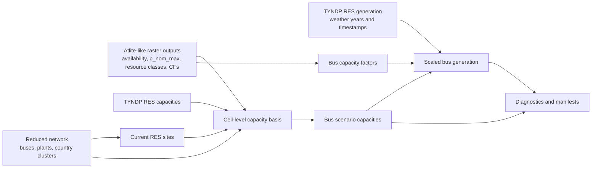

# RES Pipeline

Dieses Verzeichnis enthaelt die aktuelle Pipeline fuer die Disaggregation von
nationale RES-Daten auf das reduzierte Netz.

Die Skripte koennen lokal im Git-Repo liegen, waehrend die Daten separat unter
einem gemeinsamen `project_root` liegen, zum Beispiel
`Y:\Group_SEM\MA_Eric\Dissertation\pypsa\opf`.

## Prozessbild



## Kernskripte

- `res_capacity_preprocessing.py`
  Baut aus einem Atlite-Case und dem gewaehlten `network_dir` ein
  szenariospezifisches RES-Raster sowie busweise Ist-, Zusatz- und
  Szenario-Kapazitaeten; erzeugt das Onshore-Voronoi bei Bedarf automatisch.
- `res_generation_disaggregation.py`
  Disaggregiert die nationale RES-Erzeugung aus der Long-CSV auf die Busse des
  reduzierten Netzes.
- `run_res_workflow_cases.py`
  Wrapper fuer mehrere Atlite-Cases inklusive optionalem
  PyPSA-Vergleichsplot.
- `plot_pypsa_vs_ours_compare.py`
  Optionaler Diagnoseplot fuer Rastervergleich zwischen PyPSA-Extrakt und
  aktuellem Atlite-Case.
- `res_common.py`
  Gemeinsame Helfer fuer Country-Mapping, Netzartefakte und Voronoi-Erzeugung.

## Erwartete Inputs

- Netzdaten aus `grid/<target_year>/<network_case>/`:
  `buses.csv`, `plants.csv`, optional `cesa_country_clusters.csv`
- Der separate Ordner `powerplants/` wird von dieser RES-Pipeline aktuell nicht
  direkt gelesen; verwendet wird die bereits auf das reduzierte Netz gemappte
  `plants.csv` im jeweiligen Netzfall.
- Nationale Zielkapazitaeten:
  `renewables/res_generation_mapping_diag_<year>_tyndp2024.csv`
- Nationale Erzeugungs-Long-CSV:
  `renewables/res_load_country_long_<year>_tyndp2024.csv`
- Atlite-Cases unter `renewables/atlite_copy/<case_name>/` mit
  `availability_onshore.nc`, `availability_offshore.nc` und den
  technologiespezifischen CF-Dateien in `pv/`, `onwind/`, `offwind/`
- Geometrien aus `datashapes/`, insbesondere `europe_shape.geojson`,
  `country_shapes.geojson` und `eez_offshore_eu27_uk_no_europe_only.geojson`

## Aktuelle Atlite-Cases im Workspace

- `corine_luisa_wdpa_onoff_acdc`
- `corine_luisa_wdpa_on_acdc`

## Datenlogik

- Onshore:
  `global raster -> onshore Voronoi -> reduced bus`
- Offshore:
  `global raster -> EEZ-Land -> nearest reduced bus in model country`
- Modelllaender:
  werden aus `buses.csv` und `cesa_country_clusters.csv` analog zur
  Lastdisaggregation abgeleitet.
- Ist-Kapazitaeten:
  werden aus `plants.csv` je Bus aggregiert.
- Zielkapazitaeten:
  kommen standardmaessig aus
  `res_generation_mapping_diag_<year>_tyndp2024.csv`; `solar_pv` und
  `solar_rooftop` werden zu `pv` zusammengefasst, Offshore-AC/DC zu `offwind`.
- Optionale Zellfilter:
  `min_p_nom_max` filtert Rasterzellen mit zu kleinem installierbarem
  Potential (`p_nom_max_mw` pro Zelle), `min_p_max_pu` filtert Rasterzellen
  mit zu kleinem mittleren Zell-CF. `min_distance_offshore_km` und
  `max_distance_offshore_km` filtern nur `offwind`-Zellen anhand ihrer
  Distanz zur Kueste; die Distanz wird aus den Zellmittelpunkten und den
  Onshore-Masken berechnet. Alle Filter greifen im Capacity-Preprocessing vor
  der Allokation von Ist- und Zielkapazitaeten, der Offshore-Distanzfilter
  bereits vor EEZ- und Bus-Zuordnung.
- Generation:
  wird fuer die `peak_timestamp`-Zeitpunkte aus der Long-CSV ueber
  busgewichtete CFs auf das reduzierte Netz skaliert. Wenn fuer ein
  Modellland/Technologie/Zeitpunkt keine nutzbaren Atlite-Profile vorliegen
  (`NaN`, nicht `0`), faellt die Verteilung proportional auf die Busse mit
  installierter Szenario-Kapazitaet des Landes zurueck.
- Wetterjahre:
  `start_year` und `end_year` sind optional; standardmaessig ist der Bereich
  `1982` bis `2016`. Massgeblich sind die tatsaechlich vorhandenen CF-Dateien
  im jeweiligen Atlite-Case. Fehlende Jahre werden mit Warnung uebersprungen.

## Outputs des Capacity-Preprocessings

Standardpfad:
`renewables/<target_year>/<network_case>/res_<case_name>/res_bus_cap_preprocessed/`

- `res_capacity_cells.nc`
- `res_bus_lookup.csv`
- `res_capacity_bus.csv`
- `res_capacity_country_summary.csv`
- `res_capacity_preprocessing_manifest.json`

## Outputs der Generation-Disaggregation

Standardpfad:
`renewables/<target_year>/<network_case>/res_<case_name>/disaggregated/`

- `disaggregated_res_country_bus.csv`
- `res_generation_scaling_diagnostics.csv`
- `res_generation_disaggregation_manifest.json`

## Vergleichsplots

Standardpfad:
`renewables/<target_year>/<network_case>/res_<case_name>/plot_comparison/`

Die rechte Spalte ("our filtered raster") zeigt die Atlite-Raster nach
Anwendung von `min_p_nom_max`, `min_p_max_pu` und den Offshore-Distanzfiltern
auf Rasterzellenebene, aber ohne Bus-Aggregation. Der Standardausschnitt ist
auf Festland-Europa inklusive UK, Nord-Norwegen, Suedeuropa und Ukraine
begrenzt (`plot_bounds: [-11.5, 34.0, 41.5, 72.5]`), damit entfernte Inseln die
Achsen nicht verzerren.

## Typische Nutzung

Einzelne Schritte ueber die Templates:

```powershell
python .\res_capacity_preprocessing.py --config .\res_capacity_template.yaml
python .\res_generation_disaggregation.py --config .\res_generation_template.yaml
```

Die Template-Dateien koennen im Repo bleiben; relative Datenpfade in der YAML
werden gegen `project_root` aufgeloest.

Mehrere vorhandene Atlite-Cases in einem Lauf:

```powershell
python .\run_res_workflow_cases.py `
  --project-root Y:\Group_SEM\MA_Eric\Dissertation\pypsa\opf `
  --network-dir grid\target_year_2030\electrical_spectral_line_equivalent_dc_effective_reactance `
  --min-p-max-pu 0.05 `
  --min-p-nom-max 5 `
  --atlite-cases corine_luisa_wdpa_onoff_acdc corine_luisa_wdpa_on_acdc
```

Alternativ ueber eine zusammengefasste Wrapper-YAML:

```powershell
python .\run_res_workflow_cases.py --config .\res_workflow_cases_template.yaml
```

Die Datei [res_workflow_cases_template.yaml](res_workflow_cases_template.yaml)
fasst die fuer den Wrapper relevanten Einstellungen der beiden Einzelschritte
zusammen. CLI-Argumente koennen die YAML-Werte weiterhin gezielt ueberschreiben.

Wenn du unterschiedliche Schwellen pro Technologie willst, kannst du im
Capacity-YAML statt eines Skalars auch ein Mapping setzen, zum Beispiel:

```yaml
min_p_max_pu:
  pv: 0.05
  onwind: 0.10
  offwind: 0.15
min_p_nom_max:
  pv: 5
  onwind: 10
  offwind: 20
min_distance_offshore_km:
max_distance_offshore_km: 100
```

Dasselbe geht jetzt auch direkt ueber den Wrapper-CLI:

```powershell
python .\run_res_workflow_cases.py `
  --project-root Y:\Group_SEM\MA_Eric\Dissertation\pypsa\opf `
  --network-dir grid\target_year_2030\electrical_spectral_line_equivalent_dc_effective_reactance `
  --min-p-max-pu 'pv=0.05,onwind=0.10,offwind=0.15' `
  --min-p-nom-max 'pv=5,onwind=10,offwind=20' `
  --atlite-cases corine_luisa_wdpa_onoff_acdc
```

Unterstuetzt werden sowohl skalare Werte als auch Mappings im Format
`pv=...`, `onwind=...`, `offwind=...`; alternativ funktionieren auch JSON- oder
YAML-Mappings. In der Wrapper-YAML kannst du dieselben Mappings direkt als
normale YAML-Objekte setzen.
