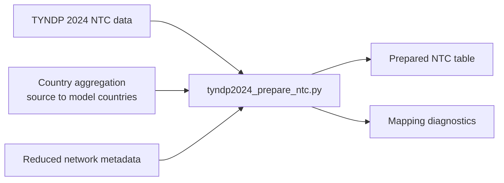

# Transmission Capacity Preparation

This directory contains the TYNDP 2024 net transfer capacity preprocessing used
when the downstream model requires country- or model-country-level exchange
limits in addition to the physical reduced grid.

## Workflow



## Main Script

- `tyndp2024_prepare_ntc.py`
  reads TYNDP 2024 transfer capacity data, applies the model-country
  aggregation used by the selected grid case, and writes a topology-consistent
  NTC table for later model input.

## Method

The script separates source-country labels from model-country labels. This is
important when the grid workflow combines several countries into an aggregate
for topological or data-quality reasons. The NTC preparation keeps diagnostics
so that each reduced exchange can be traced back to the source countries.

## Typical Inputs

- TYNDP 2024 NTC table
- `cesa_country_clusters.csv` from the active grid case
- optional network metadata and exclusion files

## Typical Outputs

- prepared NTC CSV for the reduced topology
- diagnostics on source-to-model-country mapping

## Example

```powershell
python .\tyndp2024_prepare_ntc.py --config .\ntc_config.yaml
```

If no dedicated YAML is used, pass the input and output paths directly via CLI
arguments.
